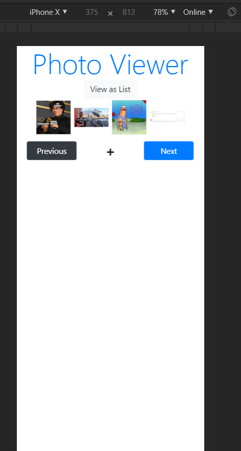

 # Photo Viewer
 This application is a full-stack appplication that I built from scratch using the MERN stack. I integrated an AWS S3 bucket to store the images.
 ## Screenshots
<p float="left">
  
 
 
 
 
 
 
 
 
<p>

 ## What is the MERN stack?
 The MERN stack is a web development stack that used JavaScript on the frontend and backend. The elements of the stack are 
 > the **MongoDB** database, the **Express.js** web application framework for the backend, the **React.js** web framework for the frontend, and the **Node.js** runtime.
## How does this application work?
The application has login functionality. When you log in with your credentials, the gallery is loaded. The gallery only loads the images that are linked to a particular username.

A record of the usernames, passwords, and image URLs are stored in MongoDb collections.
## How is the database structured?
**Users collection**
Column | Data Type | Description
 - | - |  -
 username | String | Usernames of the users registered
password | String | passwords of the users stored in plain text

**Images collection**
Column | Data Type | Description
- | - | -
url	| String | Download URL of file on AWS S3 bucket
uploader | String | The user who uploaded the file. Value extracted from username field in document of Users collection

## Application Architecture


# Notes
[Explanation of Async](https://www.stanleyulili.com/javascript/asynchronous-programming-with-callbacks-in-javascript/)

[Async/await](https://developer.mozilla.org/en-US/docs/Learn/JavaScript/Asynchronous/Async_await)

[Promises](https://developer.mozilla.org/en-US/docs/Web/JavaScript/Reference/Global_Objects/Promise)

[Callback formats for Mongoose](https://mongoosejs.com/docs/queries.html)


To run backend server, use ```nodemon server```. To use frontend server, use ```npm start```. To create build version, use ```npm run build```.

 [File Upload](https://www.pluralsight.com/guides/asynchronous-file-upload-react)

